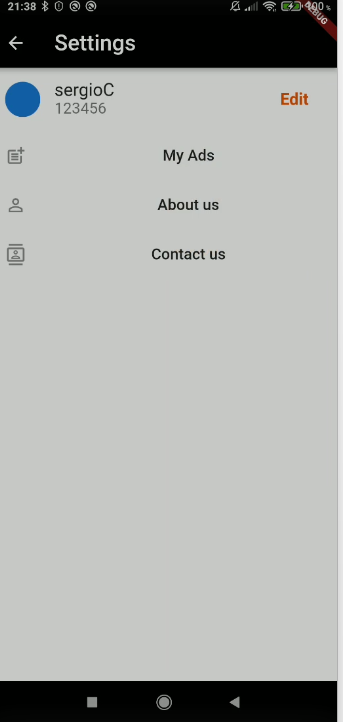

# ad_listing_full_app

git branch 23_grid_view_2 && git checkout 23_grid_view_2 && git add . && git commit -m "23_grid_view_2" && git push --set-upstream origin 23_grid_view_2

# ad_listing_full_app

# App Screens

## Screenshots

