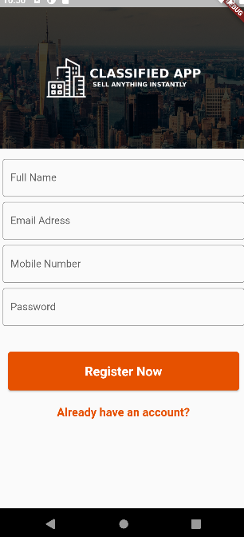
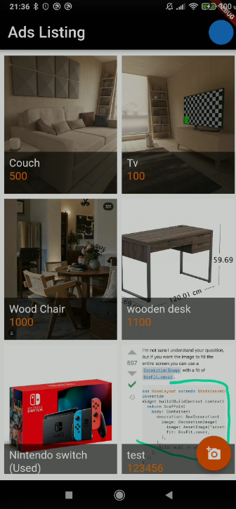
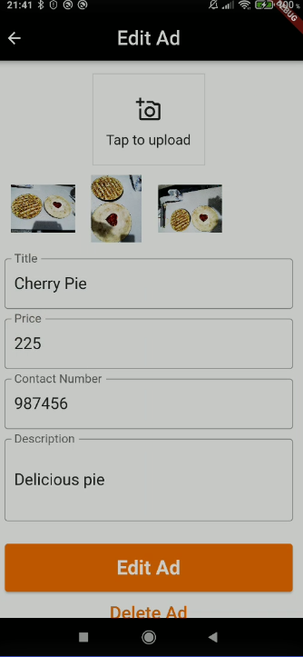
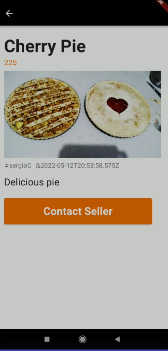

# ad_listing_full_app

git branch 27_ad_listing_with_firebase && git checkout 27_ad_listing_with_firebase && git add . && git commit -m "27_ad_listing_with_firebase" && git push --set-upstream origin 27_ad_listing_with_firebase

# ad_listing_full_app

# App Screens

## Screenshots

